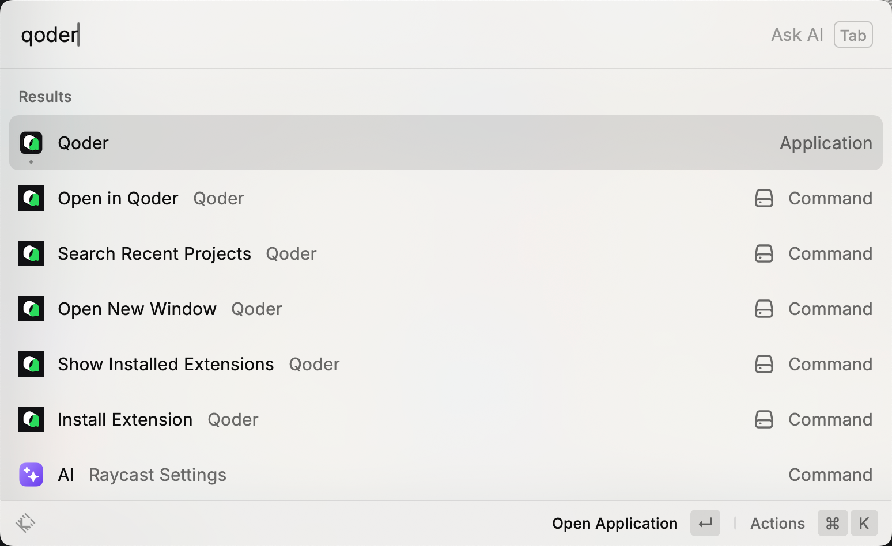

# Qoder

Control Qoder directly from Raycast



## What is this extension

A Raycast extension that provides quick access to Qoder AI Editor with convenient commands for opening windows, managing recent projects, and opening files directly from Finder.

## Features

- **Open New Window** - Launch a new Qoder window instantly
- **Search Recent Projects** - Quickly search and open your recently accessed Qoder projects
- **Open in Qoder** - Open selected files or folders from Finder directly in Qoder
- **Install Extension** - Install Qoder extensions by ID from the marketplace
- **Show Installed Extensions** - View and manage all installed Qoder extensions

## Installation

1. Install [Raycast](https://raycast.com)
2. Install Qoder AI Editor
3. Import this extension into Raycast

## Commands

### Open New Window
Opens a new Qoder window.

### Search Recent Projects
Displays a searchable list of your recent Qoder projects with actions to:
- Open in Qoder
- Show in Finder
- Open with other applications
- Copy project path

### Open in Qoder
Opens the currently selected file or folder in Finder with Qoder.

### Install Extension
Install a Qoder extension by entering its ID (e.g., `ms-python.python`). The extension will be installed directly in Qoder.

### Show Installed Extensions
Displays a searchable list of all installed Qoder extensions with actions to:
- Open extension folder
- Copy extension ID
- Copy extension name

## Requirements

- macOS
- [Raycast](https://raycast.com)
- Qoder AI Editor installed with bundle ID `com.qoder.ide`

## Development

```bash
npm install
npm run dev
```

## License

MIT